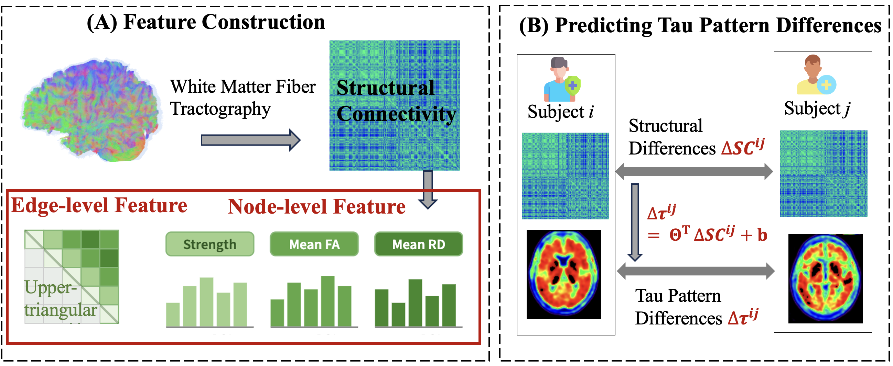

# SC-TauPath

**How Structural Connectivity Differences Shape Tau Distribution in Alzheimer's Disease**

This repository contains the analysis code for **SC-TauPath**, accepted at the *17th International Conference on Machine Learning in Medical Imaging (MLMI 2026)*.

SC-TauPath asks a simple question: if two people have different white-matter wiring, do they accumulate tau in predictably different places? Instead of predicting each subject's tau map directly, we model **inter-subject differences**: the difference in structural connectivity (ΔSC) between a pair of subjects is used to predict the difference in their regional tau-PET distribution (Δτ), across 246 Brainnetome regions.



## Method overview

```
For each subject pair (i, j):
    ΔSC_ij  =  SC_i − SC_j          (structural connectome edge features)
    Δτ_ij   =  τ_i  − τ_j           (246-ROI tau-PET SUVR difference)

Pipeline (per CV fold, fully out-of-fold):
    1. z-score SC features on the training subjects
    2. PCA on SC features (full rank of fit-train, ~158 dims)
    3. Multi-output Ridge:  ΔSC (PCA space) → Δτ  (α selected on a held-out validation split)
    4. Attribution: Ridge coefficients back-projected through PCA to edge space
         edge_importance[k] = Σ_r |coef[edge_k, roi_r]|
         hub_score[r]       = Σ_{k : r ∈ edge_k} edge_importance[k]
```

Three levels of analysis:

1. **Overall** — one model on all pairs → global edge importance and hub ROIs.
2. **Pair-type stratified** — separate models per diagnostic pair type (CN–CN, CN–MCI, CN–AD, MCI–MCI, MCI–AD, AD–AD) → which connections drive tau differences in each group comparison.
3. **Stability** — cross-fold Jaccard overlap of top-K edges, for both overall and per-pair-type importance.

An optional **Network Diffusion Model (NDM)** branch adds diffusion-physics features (entorhinal-seeded by default), either concatenated to the SC features (`--ndm-enable`), as the sole input (`--ndm-only`, ablation), or as a physics baseline whose residual the Ridge model predicts (`--ndm-residual`).

## Statistical evaluation

All reported metrics are **out-of-fold (OOF)**:

- **Subject-level 5-fold CV.** Splits are made over *subjects*, not pairs; test pairs are built only within held-out subjects, so no subject appears on both sides of a train/test boundary.
- **Prediction metric.** Mean per-pair Pearson correlation between predicted and observed 246-dim Δτ vectors, plus flattened R² and MSE. A zero-prediction baseline is always reported alongside.
- **Permutation test** (`--perm-test`). One-sided exact test with +1 correction (H1: observed mean per-pair Pearson > random pairing), null built by permuting prediction rows across pairs. `--perm-test-pair-types` additionally runs the test within each diagnostic pair type.
- **Attribution stability.** Jaccard overlap of the top-K (default 200) most important edges across CV folds, overall and per pair type.

## Requirements

- Python ≥ 3.8
- `numpy`, `scipy`, `scikit-learn`

```bash
pip install numpy scipy scikit-learn
```

`SCTauPath.py` imports feature-building and NDM utilities from the companion module `quick_train_tau_mlp_gpu.py` (`build_full_network_features`, `ndm_precompute_eig`, `fit_ndm_global_params`, …). That module must be importable — either in the same directory or under `Model/`.

## Data

The input data are derived from **ADNI** (DTI structural connectomes + tau-PET SUVR on the Brainnetome-246 atlas); access can be requested at [adni.loni.usc.edu](https://adni.loni.usc.edu/).

The script expects:

1. **`--data`** — a `.npz` file with:
   - `subject_ids` — array of subject IDs
   - `A` — per-subject SC edge features (indexed by `edge_feature_names`, e.g. streamline count `A_count`)
   - `X` — per-subject node features (indexed by `node_feature_names`, e.g. `strength_count`, `mean_fa_nonzero`, `mean_rd_nonzero`)
   - `y_suvr` — tau-PET SUVR, shape `(n_subjects, 246)`
   - `edge_feature_names`, `node_feature_names`
2. **`--pair-csv`** — a CSV with at least `subject_id` and `pet_diagnosis_label` (CN / MCI / AD) columns.

In the paper, the cohort is 234 subjects, yielding 5,359 unique out-of-fold subject pairs.

## Usage

Main analysis as reported in the paper (SC-only, with permutation tests):

```bash
python SCTauPath.py \
    --data  path/to/brainnectome_gnn_pet_tau_suvr.npz \
    --pair-csv path/to/diagnosis_labels.csv \
    --out-dir  results/pairwise_attribution \
    --perm-test --perm-test-pair-types --n-perm 2000
```

Useful variants:

```bash
# Also fit PLS and Lasso for model comparison (slower)
python SCTauPath.py ... --compare-models

# SC + NDM diffusion features (entorhinal seed, ROIs 115/116)
python SCTauPath.py ... --ndm-enable

# NDM-only ablation: does diffusion physics alone predict tau differences?
python SCTauPath.py ... --ndm-only

# Residual mode: NDM as physics baseline, Ridge predicts Δ(τ − τ_NDM) from ΔSC
python SCTauPath.py ... --ndm-residual

# Multiple NDM seed groups (semicolon-separated)
python SCTauPath.py ... --ndm-enable --ndm-seed-ids "115,116;213,214"
```

Key options (see `python SCTauPath.py -h` for the full list): `--cv-folds` (default 5), `--seed` (default 42), `--topk-edges` (default 200), `--ridge-alphas`, `--pca-components` (0 = full rank), `--no-augment` (use unordered pairs only for training).

## Outputs

All files are written to `--out-dir`:

| File | Contents |
|---|---|
| `pairwise_attr_fold_metrics.csv` | Per-fold prediction metrics (Ridge / PLS / Lasso / zero baseline) |
| `pairwise_attr_oof_predictions.npz` | OOF pair-level predictions (subject IDs, diagnoses, true/predicted Δτ) |
| `pairwise_attr_edge_importance.csv` | All 30,135 edges, overall + per-pair-type importance |
| `pairwise_attr_edge_topk.csv` | Top-K edges overall |
| `pairwise_attr_edge_topk_<TYPE>.csv` | Top-K edges per pair type |
| `pairwise_attr_hub_roi_scores.csv` | Hub ROI scores (overall + per pair type) + mean tau |
| `pairwise_attr_hub_roi_<TYPE>.csv` | Hub ROI scores per pair type |
| `pairwise_attr_pair_type_metrics.csv` | OOF metrics per pair type incl. permutation p-values |
| `pairwise_attr_stability.json` | Cross-fold Jaccard stability of top-K edges |
| `pairwise_attr_meta.json` | Full configuration + summary (fold means/SDs, permutation tests, stability) |

## Citation

If you use this code, please cite:

> Zhang, J., Scheel, N., Chen, M., Chen, T., Lyu, Y., Zhu, D. C., Zhang, R., and Zhu, D. (2026). "SC-TauPath: How Structural Connectivity Differences Shape Tau Distribution in Alzheimer's Disease." In *17th International Conference on Machine Learning in Medical Imaging (MLMI)*. To appear.

```bibtex
@inproceedings{zhang2026sctaupath,
  title     = {{SC-TauPath}: How Structural Connectivity Differences Shape Tau Distribution in {A}lzheimer's Disease},
  author    = {Zhang, J. and Scheel, N. and Chen, M. and Chen, T. and Lyu, Y. and Zhu, D. C. and Zhang, R. and Zhu, D.},
  booktitle = {17th International Conference on Machine Learning in Medical Imaging (MLMI)},
  year      = {2026},
  note      = {To appear}
}
```

## Acknowledgments

Data used in this work were obtained from the Alzheimer's Disease Neuroimaging Initiative (ADNI) database. The Brainnetome atlas (246 ROIs) is used for regional parcellation.
